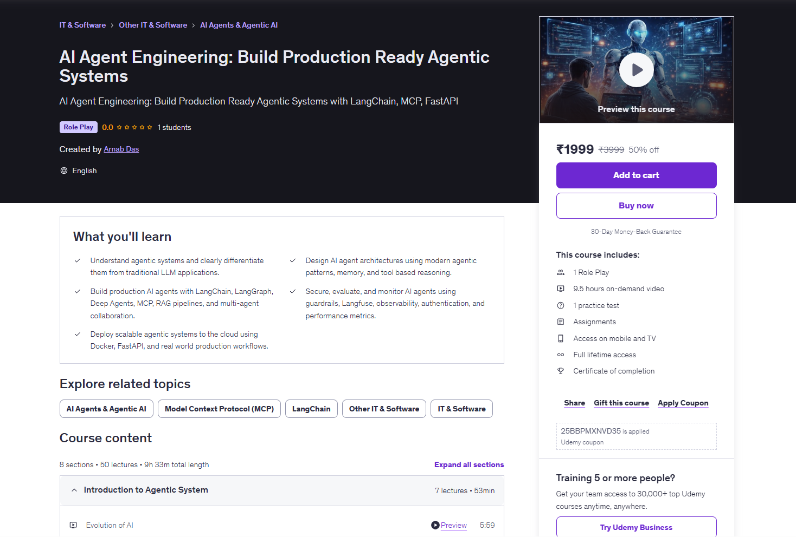
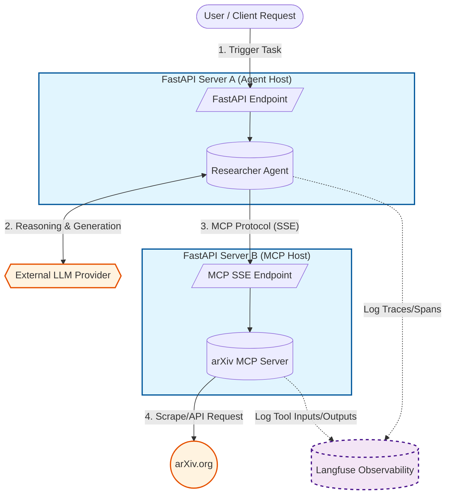

<h1 align="center">
  <a href="https://github.com/raj713335/AI_Agent_Engineering_Build_Production_Ready_Agentic_Systems">
    AI Agent Engineering: Build Production Ready Agentic Systems
  </a>
</h1>

<p align="center">
  🚀 Production-Grade Agentic Systems with LangChain, MCP, RAG & FastAPI
</p>

<p align="center">
  
</p> 

---

## Problem Statement

Modern AI applications are rapidly evolving from simple prompt-based chatbots to **autonomous agentic systems** capable of:

* Planning and reasoning
* Using tools and APIs
* Collaborating with other agents
* Accessing enterprise knowledge bases
* Operating securely in production environments

However, most learning resources stop at demos and do not cover:

* Real agent architecture patterns
* Production deployment
* Observability and evaluation
* Security, guardrails, and authentication
* Multi-agent workflows

This project repository provides **complete resource material, architecture examples, and implementation guides** for building real-world, production-ready AI agent systems.

---

## Capstone Project 



## 🎓 About the Course

This repository supports the Udemy course:

### **AI Agent Engineering: Build Production Ready Agentic Systems**

Build modern AI agents using:

* LangChain
* LangGraph
* Deep Agents
* MCP (Model Context Protocol)
* RAG Pipelines
* FastAPI
* Docker
* Observability with Langfuse

---

## 📚 What You'll Learn

* ✅ Understand agentic systems and how they differ from traditional LLM apps
* ✅ Design modern agent architectures with memory and tool reasoning
* ✅ Build production AI agents using LangChain and MCP
* ✅ Implement RAG pipelines for enterprise knowledge
* ✅ Secure agents with authentication and guardrails
* ✅ Add observability and evaluation using Langfuse
* ✅ Deploy scalable systems using FastAPI and Docker
* ✅ Design multi-agent collaboration workflows

---

## 🧠 Course Modules Overview

**8 Sections • 50 Lectures • 9+ Hours**

### 🔹 Evolution of AI

* From rule-based systems to autonomous agents

### 🔹 Agentic AI Fundamentals

* What is Agentic AI?
* Benefits of Agentic Systems
* Agentic Design Patterns
* Highly Autonomous Architectures

### 🔹 Framework Comparisons

* LangChain vs LangGraph vs Deep Agents
* MCP vs A2A

### 🔹 Production Engineering

* Tool integration
* Memory systems
* Observability & monitoring
* Security and authentication
* Deployment pipelines

---

## 🛠️ Tech Stack Covered

| Layer             | Technologies                 |
| ----------------- | ---------------------------- |
| LLM Orchestration | LangChain, LangGraph         |
| Agent Framework   | Deep Agents                  |
| Context Protocol  | MCP (Model Context Protocol) |
| Backend API       | FastAPI                      |
| Observability     | Langfuse                     |
| Deployment        | Docker                       |
| Retrieval         | RAG (Vector Databases)       |

---

## 📁 Repository Structure

```
AI_Agent_Engineering_Build_Production_Ready_Agentic_Systems/
│
├── AI_Agent_Client/
├── AI_Agent_MCP_Server/
├── Architecture_Diagram/
├── DeepAgent/
├── LangChain/
├── Langfuse/
├── LangGraph/
```

Each folder contains:

* Source code
* Architecture diagrams
* Implementation examples
* Exercises and assignments
* Production patterns

---

## 💻 Requirements

Before starting:

* Basic Python knowledge
* Familiarity with REST APIs and JSON
* Understanding of LLMs (ChatGPT experience is enough)
* Python 3.11+
* VS Code / PyCharm
* Internet connection

---

## 🚀 Getting Started

### 1️⃣ Clone the Repository

```bash
git clone https://github.com/raj713335/AI_Agent_Engineering_Build_Production_Ready_Agentic_Systems
cd AI_Agent_Engineering_Build_Production_Ready_Agentic_Systems
```

---

### 2️⃣ Create Virtual Environment

```bash
python -m venv venv
source venv/bin/activate   # Mac/Linux
venv\Scripts\activate      # Windows
```

---

### 3️⃣ Install Dependencies

```bash
pip install -r requirements.txt
```

---

### 4️⃣ Run FastAPI Agent

```bash
cd AI_Agent_Client
python main.py
```

Open Swagger UI:

```
http://127.0.0.1:9100/api/docs
```

---

### 5️⃣ Run MCP Server

```bash
cd AI_Agent_MCP_Server
python main.py
```

Open Swagger UI:

```
http://127.0.0.1:8000/api/docs
```

---


## 🔗 Course Link

👉 GitHub Repository:
[https://github.com/raj713335/AI_Agent_Engineering_Build_Production_Ready_Agentic_Systems](https://github.com/raj713335/AI_Agent_Engineering_Build_Production_Ready_Agentic_Systems)


## ⭐ Support the Project

If you find this repository helpful:

* ⭐ Star the repo
* 🍴 Fork it
* 📢 Share with others
* 🧠 Build your own agentic systems

---

## 🚀 Ready to Move Beyond Chatbots?

Start building **real-world AI agents** that reason, plan, collaborate, and operate in production.

---

### Thank You 🙌
